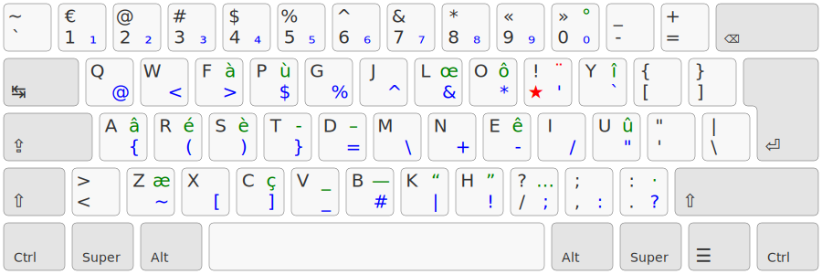

# Colemak French Touch

Une adaptation de la disposition de clavier Colemak pour le français.

## TL;DR;

- une disposition de clavier adaptée du Colemak, optimisée pour le français, l’anglais et la programmation
- la plupart des raccourcis habituels sont préservés
- une touche morte (la « french touch », ou « 1dk ») est utilisée pour accéder aux caractères accentués et aux caractères typographiques nécessaires à l’écriture du français (en vert)
- les symboles de programmation sont accessibles sur la couche AltGr (en bleu)
- Hormis les nombres, toutes les lettres et symboles sont accessible sur un clavier 3 x 10

## Inspiration

Cette disposition, issue de discussions entre les contributeurs du [Discord Ergo‑L](https://discord.gg/5xR5K3nAFX), est inspirée de 
- [Colemak9](https://colemak.com/)
- [QWERTY-Lafayette](https://qwerty-lafayette.org/)
- [Ergo‑L](https://ergol.org/)
- [Colemak DH Fr](https://gitlab.com/gagbo/colemak-dh-fr)

## Alternatives

- [QWERTY-Lafayette](https://qwerty-lafayette.org/) a.k.a. « la meilleure distribution du monde », est une alternative à QWERTY, auquel elle ajoute la 1dk pour permettre une typographie soignée en français et un usage facilité sur les claviers ergonomiques, tout en étant utilisable sans apprentissage par les utilisateurs QWERTY
- [Ergo‑L](https://ergol.org/) qui a tous les avantages de QWERTY-Lafayette et de Colemak French Touch, mais en cherchant l’optimisation maximale de la couche alphabétique pour le français et l'anglais, au prix d’un réapprentissage plus important.

Ces trois dispositions partagent en très grande partie la couche des symboles, afin de faciliter la transition entre elles.

## TODO

- doc d'install, lien vers Kalamine, etc
- separer les svg alpha/1dk/symboles
- packager les drivers
- ajouter une variante basée sur Colemak DH
- suivre les maj de la couche AltGr Ergo‑L
- itérer sur la couche 1dk
